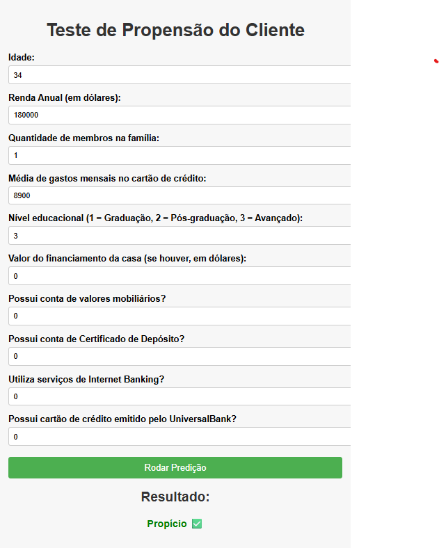
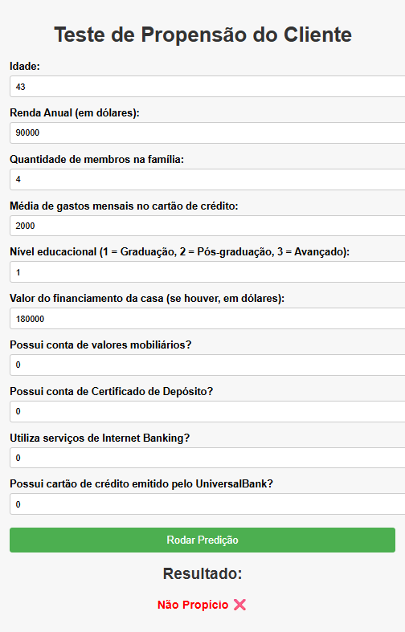

# 📊 Análise de Campanha de Marketing Bancário (Bank Marketing Campaign Analysis)

Este projeto tem como objetivo **identificar os clientes mais propensos a aceitar uma oferta de marketing** e **maximizar o lucro esperado** do banco.

## Estrutura do Projeto

```plaintext
Bank_loan_defaulter/
│
├─ Dashboard/
│   └─ Dashboard.pbix                   # Dashboard Power BI para estudo dos dados
├─ Data/
│   ├─ raw_data.csv                     # Dados brutos extraídos de Kaggle
│   └─ modified_data.csv                # Dados processados e modificados para análise
├─ Model/
│   └─ model.pkl                        # Pipeline com o modelo de melhor desempenho
├─ Notebooks/
│   ├─ 01_Data_Extraction_Analysis.ipynb  # Notebook de exploração e análise dos dados
│   └─ 02_Models.ipynb                  # Treinamento e avaliação dos modelos
├─ Web_Deploy/
│   ├─ Backend/                          # API FastAPI para servir o modelo
│   └─ Frontend/                         # Interface web para inserir dados e receber predição
├─ .gitignore                            
├─ environment.yml                        # Ambiente Conda para reprodução
└─ README.md                             # Documentação do projeto
```  

## Objetivo

- Prever clientes que provavelmente aceitarão uma oferta de marketing.
- Avaliar modelos de Machine Learning com foco em **lucro esperado**.
- Determinar o **threshold ótimo de probabilidade** para maximizar retorno.

## Modelos Testados

| Modelo | Descrição |
|--------|-----------|
| DecisionTreeClassifier | Árvore de decisão |
| LogisticRegression | Regressão logística |
| GaussianNB | Naive Bayes Gaussiano |
| KNeighborsClassifier | K-vizinhos mais próximos |
| GradientBoostingClassifier | Gradient Boosting |
| XGBClassifier | XGBoost |

### Samplers Testados

Para lidar com o desbalanceamento da base de clientes (Recusaram = 4520, Aceitaram = 480), foram testadas diferentes técnicas de amostragem:

| Sampler | Descrição |
|---------|-----------|
| **NoSampling** | Utilização direta dos dados originais, sem nenhuma técnica de balanceamento. |
| **SMOTE** | Cria novos exemplos sintéticos da classe minoritária com base em vizinhos. |
| **RandomOver** | Sobreamostra aleatoriamente a classe minoritária até equilibrar a distribuição. |
| **RandomUnder** | Subamostra aleatoriamente a classe majoritária para equilibrar as classes. |
| **SMOTEENN** | Combina SMOTE com remoção de exemplos ruidosos da classe majoritária usando ENN. |
| **SMOTETomek** | Combina SMOTE com remoção de pares Tomek links, criando minoritária e limpando a majoritária. |

## Avaliação

A avaliação dos modelos foi realizada considerando tanto métricas tradicionais de classificação quanto o lucro esperado do banco.  

### Métricas utilizadas

| Métrica | Descrição |
|---------|-----------|
| **Accuracy** | Percentual de acertos do modelo (TP+TN)/(TP+FP+TN+FN) |
| **Precision** | Proporção de predições positivas corretas (TP / (TP+FP)) |
| **Recall** | Proporção de positivos reais corretamente identificados (TP / (TP+FN)) |
| **F1-score** | Média harmônica entre Precision e Recall |
| **ROC AUC** | Área sob a curva ROC, mede a capacidade do modelo de rankear corretamente as classes |
| **Expected Profit (Lucro Esperado)** | Lucro estimado considerando o custo por envio da oferta e o retorno caso o cliente aceite a oferta. Calculado como `(TP * Ganho) - ((TP + FP) * Custo)`. |

## Cenário Hipotético

Para ilustrar a aplicação prática do modelo, consideramos o seguinte cenário:

- **Investimento total em marketing:** $10,000  
- **Custo por envio de oferta a cada cliente:** $100  
- **Retorno estimado caso o cliente aceite a oferta:** $500 

O objetivo é **enviar ofertas apenas para os clientes mais propensos a aceitar**, maximizando o lucro esperado.  

A abordagem utilizada foi:

1. **Calcular as probabilidades de aceitação** para cada cliente usando o melhor modelo treinado.  
2. **Definir o threshold ótimo de probabilidade**, que maximiza o lucro esperado.  
3. **Selecionar os clientes com probabilidade acima do threshold**, respeitando o limite máximo de clientes.  
4. **Calcular o lucro esperado** considerando:
   - Número de ofertas enviadas  
   - Custo total das ofertas  
   - Ganho bruto caso os clientes aceitem  
   - Lucro final = Ganho bruto - Custo total  

Este caso demonstra como o modelo pode **direcionar as campanhas de marketing**, priorizando clientes que oferecem maior retorno, e mostrando na prática a utilidade do **Expected Profit** como métrica de negócio.

## API (Web Deploy)




Esta API permite realizar predições de propensão de clientes a contratar produtos financeiros do banco **UniversalBank**, com base em informações como idade, renda, histórico de crédito e outros dados financeiros.

O backend foi desenvolvido em **FastAPI**, e o frontend é uma interface simples em **HTML/JavaScript** para facilitar testes manuais. O modelo de machine learning utilizado foi treinado previamente e armazenado como um pipeline serializado (`model.pkl`).